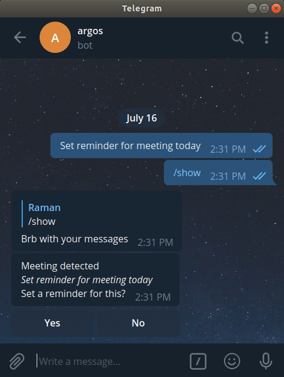
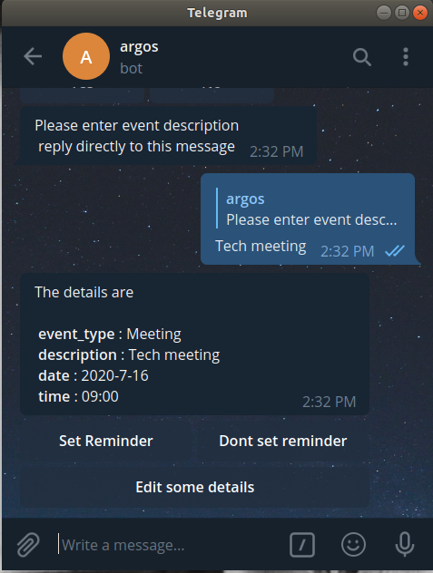
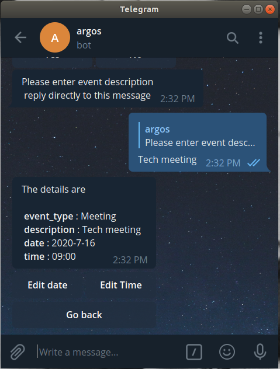
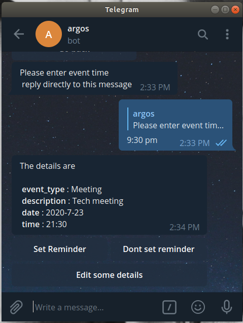
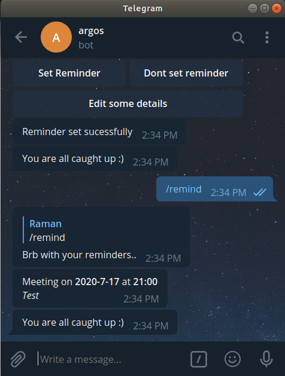

	
	<h2 align="center"> Priority Message Bot </h2>
	<h4 align="center"> Telegram bot to identify all important messages  <h4>

---
 
  
  

Have you ever scrolled through 500 messages on a group chat  😫 to look for that one message notifying members about a very important project deadline that week or a message about an important meeting.

We can help you, please 🙏 read the description to know how  

## Description

### Getting notifed about important messages

Its frustrating trying to find the needle in the haystack, don't fret 💪, we at DSC VIT understand your woes, we have been there and done that. That's why we came up with **Priority Message Bot**, a contextual AI powered bot 😎 which will analyze the conversation in a telegram group in real time and keep track of all messages which might be important

And all that you have to do is ask the bot to show all those messages. Its that simple 🤘
Use this bot and never miss another important message in your telegram group

### Get reminders about events 

Our Priority message bot not only detects and list the important messages for you, It can also send you recurring reminders 
well in advance.If an important event is detected by the bot and you would like to be reminded about it, just tell the bot to store the message.

The bot will ask you some additional details like date and time, and safely store them. And starting from 3 days before the deadline our **Reminder bot** will send recurring reminders to the telegram group

Dont believe us? Add this bot duo to your group and test them out!

## Usage and Installation

[Click here to see how to use the bot](docs/usage.md)

[Click here to see how to install this bot on your computer](docs/installation.md)

## Functionalities
- [X]  Detect and track important messages
- [X]  List tracked messages on command
- [X]  Add reminders for important events
- [X]  Get reminders well in advance before deadlines

 

## Directions To Use

Add the Priority Message Bot and Reminder Bot to your group

Use the following commands to communicate with the bot

1. /show

This command makes the bot list all important messages being tracked

2. /remind

This command makes the  bot list all the important events that will occur in the next 3 days

 

## Screenshots of the bot

## Contributors

* [  Ramaneswaran ](https://github.com/ramaneswaran)

 
 

	Made with :heart: by DSC VIT

