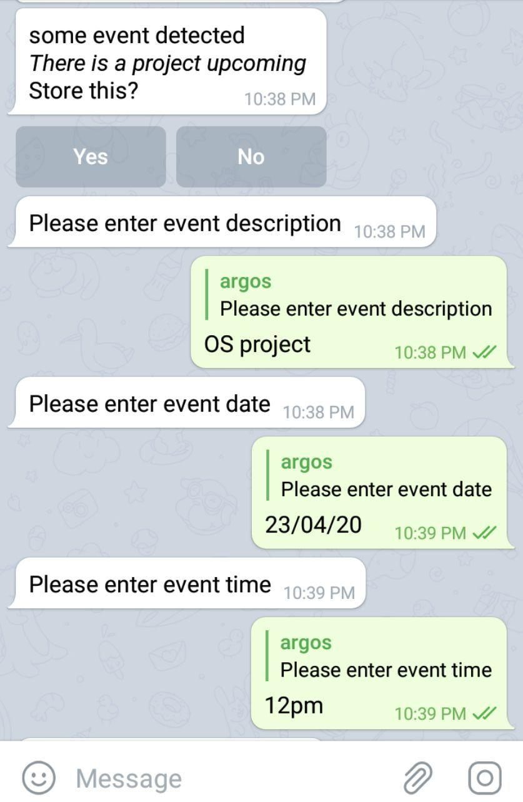
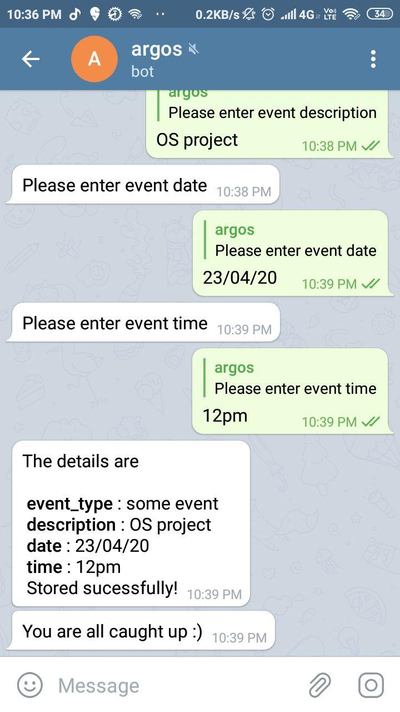
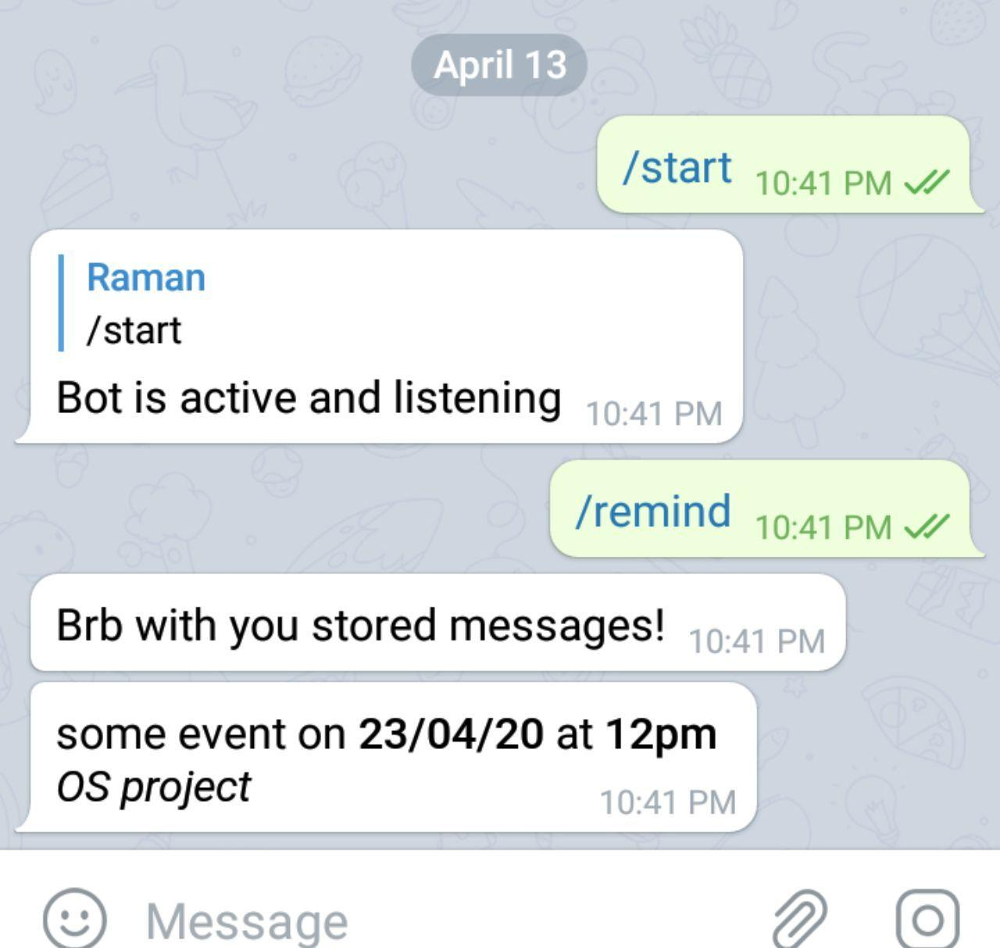

	
	<h2 align="center"> Priority Message Bot </h2>
	<h4 align="center"> Telegram bot to identify all important messages  <h4>

---
 
  
  
## Description

Have you ever scrolled through 500 messages on a group chat to look for that one message notifying members about a very important project deadline that week or a message about an important meeting. 

Its frustrating trying to find the needle in the haystack, don't fret, we at DSC understand your woes, we have been there and done that. That's why we came up with Priority Message Bot, a contextual AI powered bot which will analyze the conversation in a telegram group in real time and keep track of all messages which might be important

And all that you have to do is ask the bot to show all those messages. Its that simple
Use this bot and never miss another important message in your telegram group

Dont beleive us? Add this bot duo to your group and test them out!

## Functionalities
- [X]  Detect and track important messages
- [X]  List tracked messages on command
- [X]  Add reminders for important events
- [X]  Send reminders well in advance before deadlines

 

## Directions To Use

Add the telegram bot to your group\
It is necessary to make the bot admin of the group.
Use the following commands to communicate with the bot

1. /show

This command makes the bot list all important messages being tracked

2. /remind

This command makes the  bot list all the important events that will occur in the next 3 days

 

## Screenshots of the bot

### The /show command

### The tracked events can be stored by taking additional information

### The stored messages can be listed

## Contributors

* [  Ramaneswaran ](https://github.com/ramaneswaran)

 
 

	Made with :heart: by DSC VIT

